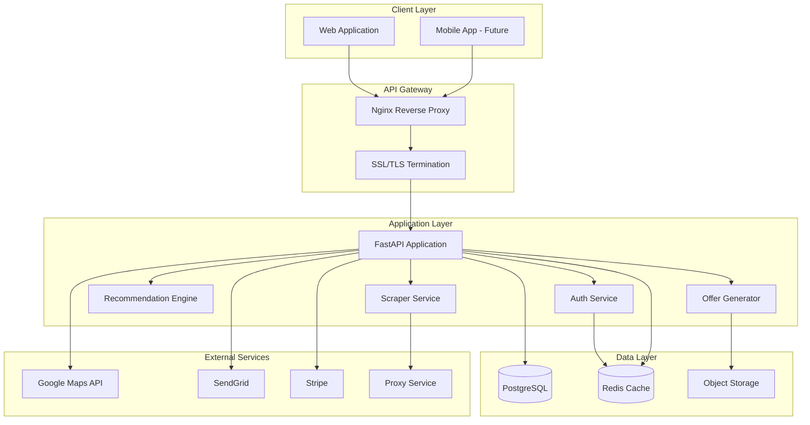

# Apartment Recommendation System - Technical Architecture

## 🏗️ System Architecture Overview



## 🔄 Data Flow Architecture

### 1. Data Ingestion Pipeline

```python
# Scraping Pipeline Flow
class ScrapingPipeline:
    """
    1. Scheduler triggers scraping job
    2. Scraper fetches data through proxy
    3. Parser extracts structured data
    4. Validator ensures data quality
    5. Deduplicator removes duplicates
    6. Enricher adds geocoding/calculations
    7. Persister saves to database
    8. Indexer updates search indices
    """
    
    def process(self):
        raw_data = self.scraper.fetch()
        parsed = self.parser.extract(raw_data)
        validated = self.validator.validate(parsed)
        unique = self.deduplicator.process(validated)
        enriched = self.enricher.enrich(unique)
        self.persister.save(enriched)
        self.indexer.update(enriched)
```

### 2. Recommendation Pipeline

```python
# AI Recommendation Flow
class RecommendationPipeline:
    """
    1. User preferences collected
    2. Historical behavior analyzed
    3. Collaborative filtering applied
    4. Content-based filtering applied
    5. Market intelligence integrated
    6. Hybrid score calculated
    7. Results ranked and filtered
    8. Personalized results returned
    """
    
    def generate_recommendations(self, user_id):
        preferences = self.get_user_preferences(user_id)
        behavior = self.analyze_behavior(user_id)
        collab_scores = self.collaborative_filter(user_id)
        content_scores = self.content_filter(preferences)
        market_scores = self.market_intelligence()
        final_scores = self.hybrid_scoring(
            collab_scores, 
            content_scores, 
            market_scores
        )
        return self.rank_and_filter(final_scores)
```

## 🗄️ Database Design Patterns

### 1. Partitioning Strategy

```sql
-- Partition price_history by month for better performance
CREATE TABLE price_history (
    id UUID,
    unit_id UUID,
    price DECIMAL(10,2),
    recorded_at TIMESTAMP
) PARTITION BY RANGE (recorded_at);

CREATE TABLE price_history_2025_01 
    PARTITION OF price_history
    FOR VALUES FROM ('2025-01-01') TO ('2025-02-01');
```

### 2. Indexing Strategy

```sql
-- Spatial index for location-based queries
CREATE INDEX idx_properties_location 
    ON properties USING GIST (
        ST_MakePoint(longitude, latitude)
    );

-- Composite index for common queries
CREATE INDEX idx_units_search 
    ON units(is_available, bedrooms, current_price);

-- Full-text search index
CREATE INDEX idx_properties_search 
    ON properties USING GIN(
        to_tsvector('english', name || ' ' || address)
    );
```

### 3. Materialized Views for Performance

```sql
-- Market statistics materialized view
CREATE MATERIALIZED VIEW market_stats AS
SELECT 
    city,
    AVG(current_price) as avg_price,
    PERCENTILE_CONT(0.5) WITHIN GROUP (ORDER BY current_price) as median_price,
    COUNT(*) as total_units,
    AVG(days_on_market) as avg_days_on_market
FROM units u
JOIN properties p ON u.property_id = p.id
JOIN market_velocity mv ON u.id = mv.unit_id
WHERE u.is_available = true
GROUP BY city;

-- Refresh strategy
CREATE INDEX ON market_stats(city);
REFRESH MATERIALIZED VIEW CONCURRENTLY market_stats;
```

## 🔐 Security Architecture

### 1. Authentication Flow

```python
# JWT Authentication Implementation
from datetime import datetime, timedelta
from jose import JWTError, jwt
from passlib.context import CryptContext

class AuthenticationService:
    pwd_context = CryptContext(schemes=["bcrypt"])
    SECRET_KEY = os.getenv("JWT_SECRET_KEY")
    ALGORITHM = "HS256"
    
    def create_access_token(self, user_id: str) -> str:
        expire = datetime.utcnow() + timedelta(hours=24)
        payload = {
            "sub": user_id,
            "exp": expire,
            "iat": datetime.utcnow(),
            "type": "access"
        }
        return jwt.encode(payload, self.SECRET_KEY, self.ALGORITHM)
    
    def create_refresh_token(self, user_id: str) -> str:
        expire = datetime.utcnow() + timedelta(days=30)
        payload = {
            "sub": user_id,
            "exp": expire,
            "iat": datetime.utcnow(),
            "type": "refresh"
        }
        return jwt.encode(payload, self.SECRET_KEY, self.ALGORITHM)
```

### 2. API Security Layers

```python
# Rate Limiting Implementation
from fastapi import HTTPException
from slowapi import Limiter
from slowapi.util import get_remote_address

limiter = Limiter(key_func=get_remote_address)

@app.get("/api/properties")
@limiter.limit("100/minute")
async def get_properties():
    # Endpoint logic
    pass

# Input Validation
from pydantic import BaseModel, validator

class PropertySearch(BaseModel):
    min_price: float = Field(ge=0, le=50000)
    max_price: float = Field(ge=0, le=50000)
    city: str = Field(min_length=2, max_length=100)
    
    @validator('max_price')
    def validate_price_range(cls, v, values):
        if 'min_price' in values and v < values['min_price']:
            raise ValueError('max_price must be >= min_price')
        return v
```

## 🚀 Deployment Architecture

### 1. Docker Configuration

```dockerfile
# Dockerfile
FROM python:3.11-slim

WORKDIR /app

# Install system dependencies
RUN apt-get update && apt-get install -y \
    gcc \
    postgresql-client \
    && rm -rf /var/lib/apt/lists/*

# Install Python dependencies
COPY requirements.txt .
RUN pip install --no-cache-dir -r requirements.txt

# Copy application
COPY . .

# Run application
CMD ["uvicorn", "app.main:app", "--host", "0.0.0.0", "--port", "8000"]
```

### 2. Docker Compose Setup

```yaml
# docker-compose.yml
version: '3.8'

services:
  api:
    build: ./backend
    ports:
      - "8000:8000"
    environment:
      - DATABASE_URL=postgresql://user:pass@db:5432/apartment_db
      - REDIS_URL=redis://redis:6379/0
    depends_on:
      - db
      - redis
    volumes:
      - ./backend:/app
    command: uvicorn app.main:app --reload --host 0.0.0.0

  db:
    image: postgis/postgis:15-3.3
    environment:
      - POSTGRES_USER=user
      - POSTGRES_PASSWORD=pass
      - POSTGRES_DB=apartment_db
    volumes:
      - postgres_data:/var/lib/postgresql/data
    ports:
      - "5432:5432"

  redis:
    image: redis:7-alpine
    ports:
      - "6379:6379"
    volumes:
      - redis_data:/data

  nginx:
    image: nginx:alpine
    ports:
      - "80:80"
      - "443:443"
    volumes:
      - ./nginx.conf:/etc/nginx/nginx.conf
      - ./ssl:/etc/nginx/ssl
    depends_on:
      - api

  celery_worker:
    build: ./backend
    command: celery -A app.celery worker --loglevel=info
    environment:
      - DATABASE_URL=postgresql://user:pass@db:5432/apartment_db
      - REDIS_URL=redis://redis:6379/0
    depends_on:
      - db
      - redis

  celery_beat:
    build: ./backend
    command: celery -A app.celery beat --loglevel=info
    environment:
      - DATABASE_URL=postgresql://user:pass@db:5432/apartment_db
      - REDIS_URL=redis://redis:6379/0
    depends_on:
      - db
      - redis

volumes:
  postgres_data:
  redis_data:
```

## 📊 Monitoring & Observability

### 1. Logging Strategy

```python
# Structured Logging Configuration
import logging
import json
from datetime import datetime

class JSONFormatter(logging.Formatter):
    def format(self, record):
        log_obj = {
            'timestamp': datetime.utcnow().isoformat(),
            'level': record.levelname,
            'message': record.getMessage(),
            'module': record.module,
            'function': record.funcName,
            'line': record.lineno
        }
        if hasattr(record, 'user_id'):
            log_obj['user_id'] = record.user_id
        if hasattr(record, 'request_id'):
            log_obj['request_id'] = record.request_id
        return json.dumps(log_obj)

# Application logging
logger = logging.getLogger(__name__)
logger.info("Property scraped", extra={
    'property_id': property_id,
    'source': 'apartments.com',
    'units_found': unit_count
})
```

### 2. Metrics Collection

```python
# Prometheus Metrics
from prometheus_client import Counter, Histogram, Gauge

# Define metrics
api_requests = Counter(
    'api_requests_total',
    'Total API requests',
    ['method', 'endpoint', 'status']
)

api_latency = Histogram(
    'api_latency_seconds',
    'API latency in seconds',
    ['method', 'endpoint']
)

active_users = Gauge(
    'active_users',
    'Number of active users'
)

scraping_success = Counter(
    'scraping_success_total',
    'Successful scraping operations',
    ['source']
)
```

## 🔄 Caching Strategy

### 1. Redis Cache Implementation

```python
# Cache Decorator
from functools import wraps
import json
import hashlib

def cache_result(expiration=3600):
    def decorator(func):
        @wraps(func)
        async def wrapper(*args, **kwargs):
            # Generate cache key
            cache_key = f"{func.__name__}:{hashlib.md5(
                json.dumps([args, kwargs], sort_keys=True).encode()
            ).hexdigest()}"
            
            # Try to get from cache
            cached = await redis_client.get(cache_key)
            if cached:
                return json.loads(cached)
            
            # Execute function
            result = await func(*args, **kwargs)
            
            # Store in cache
            await redis_client.setex(
                cache_key, 
                expiration, 
                json.dumps(result)
            )
            
            return result
        return wrapper
    return decorator

# Usage
@cache_result(expiration=1800)
async def get_property_details(property_id: str):
    # Expensive database query
    return await db.fetch_property(property_id)
```

### 2. Cache Invalidation

```python
# Cache Invalidation Patterns
class CacheManager:
    def __init__(self, redis_client):
        self.redis = redis_client
    
    async def invalidate_property(self, property_id: str):
        """Invalidate all caches related to a property"""
        pattern = f"*property:{property_id}*"
        keys = await self.redis.keys(pattern)
        if keys:
            await self.redis.delete(*keys)
    
    async def invalidate_user_recommendations(self, user_id: str):
        """Invalidate user's recommendation cache"""
        pattern = f"recommendations:{user_id}*"
        keys = await self.redis.keys(pattern)
        if keys:
            await self.redis.delete(*keys)
```

## 🎯 Performance Optimization

### 1. Database Query Optimization

```python
# Optimized Query with Eager Loading
from sqlalchemy.orm import selectinload, joinedload

async def get_properties_with_units(city: str, limit: int = 50):
    """Efficiently load properties with their units"""
    query = (
        select(Property)
        .options(
            selectinload(Property.units),  # Eager load units
            joinedload(Property.market_velocity)  # Join load velocity
        )
        .where(Property.city == city)
        .limit(limit)
    )
    return await db.execute(query)

# Connection Pooling
from sqlalchemy.pool import NullPool, QueuePool

engine = create_async_engine(
    DATABASE_URL,
    poolclass=QueuePool,
    pool_size=20,
    max_overflow=40,
    pool_timeout=30,
    pool_recycle=1800
)
```

### 2. API Response Optimization

```python
# Response Compression
from fastapi import FastAPI
from fastapi.middleware.gzip import GZipMiddleware

app = FastAPI()
app.add_middleware(GZipMiddleware, minimum_size=1000)

# Pagination Implementation
from fastapi import Query

@app.get("/api/properties")
async def get_properties(
    page: int = Query(1, ge=1),
    per_page: int = Query(50, ge=1, le=100)
):
    offset = (page - 1) * per_page
    
    properties = await db.fetch_properties(
        offset=offset,
        limit=per_page
    )
    
    return {
        "data": properties,
        "page": page,
        "per_page": per_page,
        "total": await db.count_properties()
    }
```

## 🔧 Development Workflow

### 1. Git Branching Strategy

```bash
main
├── develop
│   ├── feature/user-authentication
│   ├── feature/ai-recommendations
│   └── feature/offer-generation
├── release/v1.0.0
└── hotfix/critical-bug-fix
```

### 2. CI/CD Pipeline

```yaml
# .github/workflows/ci.yml
name: CI Pipeline

on:
  push:
    branches: [main, develop]
  pull_request:
    branches: [main]

jobs:
  test:
    runs-on: ubuntu-latest
    
    services:
      postgres:
        image: postgres:15
        env:
          POSTGRES_PASSWORD: postgres
        options: >-
          --health-cmd pg_isready
          --health-interval 10s
          --health-timeout 5s
          --health-retries 5
    
    steps:
    - uses: actions/checkout@v2
    
    - name: Set up Python
      uses: actions/setup-python@v2
      with:
        python-version: '3.11'
    
    - name: Install dependencies
      run: |
        pip install -r requirements.txt
        pip install -r requirements-dev.txt
    
    - name: Run tests
      run: |
        pytest --cov=app --cov-report=xml
    
    - name: Upload coverage
      uses: codecov/codecov-action@v2
    
    - name: Run linting
      run: |
        flake8 app/
        mypy app/
    
    - name: Security scan
      run: |
        bandit -r app/
```

## 📈 Scalability Considerations

### 1. Horizontal Scaling

```nginx
# nginx.conf - Load Balancing
upstream api_servers {
    least_conn;
    server api1:8000 weight=3;
    server api2:8000 weight=2;
    server api3:8000 weight=1;
}

server {
    listen 80;
    
    location / {
        proxy_pass http://api_servers;
        proxy_set_header Host $host;
        proxy_set_header X-Real-IP $remote_addr;
    }
}
```

### 2. Database Scaling

```python
# Read Replica Configuration
class DatabaseManager:
    def __init__(self):
        self.master = create_engine(MASTER_DB_URL)
        self.replicas = [
            create_engine(REPLICA_1_URL),
            create_engine(REPLICA_2_URL)
        ]
        self.current_replica = 0
    
    def get_read_connection(self):
        """Round-robin read replicas"""
        conn = self.replicas[self.current_replica]
        self.current_replica = (self.current_replica + 1) % len(self.replicas)
        return conn
    
    def get_write_connection(self):
        """Always write to master"""
        return self.master
```

---

*This technical architecture provides a robust, scalable foundation for the apartment recommendation system with emphasis on performance, security, and maintainability.*